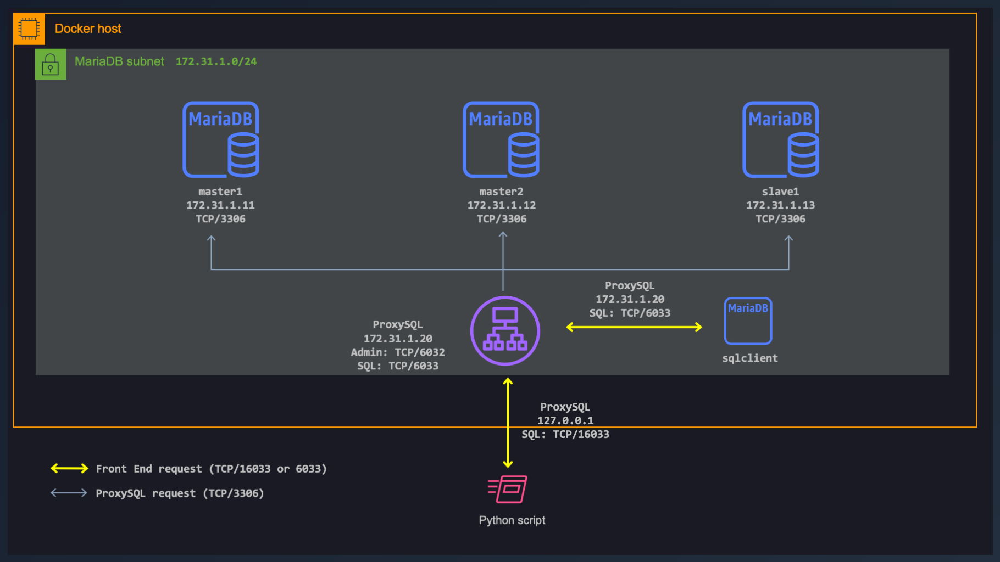

# ProxySQL Statistics

## Introduction

If you followed this [workshop on ProxySQL](README.md) you should have a working ProxySQL server. ProxySQL collects a lot of real time statistics in the stats schema, each table provides specific information about the behaviour of ProxySQL and the workload being processed. We'll go over some of the statistics at our disposal.

  

## Requirements:

* Working ProxySQL server.

## ProxySQL Statistics

### The `stats schema`

Those are the tables at our disposal. Each table provides specific information about the behavior of ProxySQL and the workload being processed.

```sql
SHOW TABLES FROM stats;
```

      +--------------------------------------+
      | tables                               |
      +--------------------------------------+
      | global_variables                     |
      | stats_memory_metrics                 |
      | stats_mysql_client_host_cache        |
      | stats_mysql_client_host_cache_reset  |
      | stats_mysql_commands_counters        |
      | stats_mysql_connection_pool          |
      | stats_mysql_connection_pool_reset    |
      | stats_mysql_errors                   |
      | stats_mysql_errors_reset             |
      | stats_mysql_free_connections         |
      | stats_mysql_global                   |
      | stats_mysql_gtid_executed            |
      | stats_mysql_prepared_statements_info |
      | stats_mysql_processlist              |
      | stats_mysql_query_digest             |
      | stats_mysql_query_digest_reset       |
      | stats_mysql_query_rules              |
      | stats_mysql_users                    |
      | stats_proxysql_servers_checksums     |
      | stats_proxysql_servers_metrics       |
      | stats_proxysql_servers_status        |
      +--------------------------------------+
      21 rows in set (0.003 sec)

#### stats_mysql_connection_pool

The `stats_mysql_connection_pool` table shows information related to the MySQL backends, connection and overall traffic. The status of each server is tracked based on the health check results.

* Healthy servers will have a status of `ONLINE`
* Servers termporarily removed are marked as `SHUNNED`
* Servers completely removed, or moved away from a hostgroup, are marked as `OFFLINE_HARD`

```sql
SELECT * FROM stats.stats_mysql_connection_pool;
```

      +-----------+-------------+----------+--------+----------+----------+--------+---------+-------------+---------+-------------------+-----------------+-----------------+------------+
      | hostgroup | srv_host    | srv_port | status | ConnUsed | ConnFree | ConnOK | ConnERR | MaxConnUsed | Queries | Queries_GTID_sync | Bytes_data_sent | Bytes_data_recv | Latency_us |
      +-----------+-------------+----------+--------+----------+----------+--------+---------+-------------+---------+-------------------+-----------------+-----------------+------------+
      | 1         | 172.31.1.11 | 3306     | ONLINE | 0        | 1        | 1      | 0       | 1           | 32      | 0                 | 832             | 384             | 748        |
      | 1         | 172.31.1.12 | 3306     | ONLINE | 0        | 1        | 1      | 0       | 1           | 46      | 0                 | 1196            | 552             | 733        |
      | 2         | 172.31.1.13 | 3306     | ONLINE | 0        | 0        | 0      | 0       | 0           | 0       | 0                 | 0               | 0               | 1006       |
      +-----------+-------------+----------+--------+----------+----------+--------+---------+-------------+---------+-------------------+-----------------+-----------------+------------+
      3 rows in set (0.004 sec)

#### stats_mysql_commands_counters

The `stats_mysql_commands_counters` table returns detailed information about the type of statements executed, and the distribution of execution time.

```sql
SELECT * FROM stats_mysql_commands_counters WHERE Total_cnt;
```

      +---------+---------------+-----------+-----------+-----------+---------+---------+----------+----------+-----------+-----------+--------+--------+---------+----------+
      | Command | Total_Time_us | Total_cnt | cnt_100us | cnt_500us | cnt_1ms | cnt_5ms | cnt_10ms | cnt_50ms | cnt_100ms | cnt_500ms | cnt_1s | cnt_5s | cnt_10s | cnt_INFs |
      +---------+---------------+-----------+-----------+-----------+---------+---------+----------+----------+-----------+-----------+--------+--------+---------+----------+
      | SELECT  | 104051        | 78        | 19        | 1         | 12      | 44      | 0        | 2        | 0         | 0         | 0      | 0      | 0       | 0        |
      | SET     | 0             | 150       | 150       | 0         | 0       | 0       | 0        | 0        | 0         | 0         | 0      | 0      | 0       | 0        |
      +---------+---------------+-----------+-----------+-----------+---------+---------+----------+----------+-----------+-----------+--------+--------+---------+----------+
      2 rows in set (0.007 sec)

#### stats_mysql_query_digest

Query information is tracked in the `stats_mysql_query_digest` table which provides query counts per backend, reponse times per query as well as the actual query text as well as the query digest which is a unique identifier for every query type.

```sql
SELECT * FROM stats_mysql_query_digest ORDER BY sum_time DESC;
```

      +-----------+--------------------+----------+----------------+--------------------+--------------------------------+------------+------------+------------+----------+----------+----------+-------------------+---------------+
      | hostgroup | schemaname         | username | client_address | digest             | digest_text                    | count_star | first_seen | last_seen  | sum_time | min_time | max_time | sum_rows_affected | sum_rows_sent |
      +-----------+--------------------+----------+----------------+--------------------+--------------------------------+------------+------------+------------+----------+----------+----------+-------------------+---------------+
      | 1         | information_schema | clients  |                | 0x29F2A166686DC769 | SELECT @@hostname hostname     | 78         | 1645080803 | 1645115307 | 104051   | 449      | 16638    | 0                 | 78            |
      | 1         | information_schema | clients  |                | 0x822FA0E1B929D2B7 | SET @@session.autocommit = OFF | 75         | 1645080803 | 1645115307 | 0        | 0        | 0        | 0                 | 0             |
      | 1         | information_schema | clients  |                | 0x3DDFFFFB35C368B8 | SET NAMES ? COLLATE ?          | 75         | 1645080803 | 1645115307 | 0        | 0        | 0        | 0                 | 0             |
      +-----------+--------------------+----------+----------------+--------------------+--------------------------------+------------+------------+------------+----------+----------+----------+-------------------+---------------+
      3 rows in set (0.010 sec)


```sql
SELECT hostgroup hg, sum_time, count_star, digest_text FROM stats_mysql_query_digest ORDER BY sum_time DESC;
```

      +----+----------+------------+--------------------------------+
      | hg | sum_time | count_star | digest_text                    |
      +----+----------+------------+--------------------------------+
      | 1  | 104051   | 78         | SELECT @@hostname hostname     |
      | 1  | 0        | 75         | SET @@session.autocommit = OFF |
      | 1  | 0        | 75         | SET NAMES ? COLLATE ?          |
      +----+----------+------------+--------------------------------+
      3 rows in set (0.006 sec)


### MySQL Query Rules

Query rules are a very powerful vehicle to control traffic passing through ProxySQL and are configured in the mysql_query_rules table.

**TODO**

### Query Caching

A popular use-case for ProxySQL is to act as a query cache. By default, queries aren’t cached, this is enabled by setting `cache_ttl` (in milliseconds) on a rule defined in `mysql_query_rules`.

**TODO**

### Query Rewrite

**TODO**

## Useful Links

Nice and useful links.

- [ProxySQL Initial Configuration](https://proxysql.com/documentation/ProxySQL-Configuration/)
- [Nice MySQL training](https://www.mysqltutorial.org/)

## License

This project is licensed under the [MIT license](LICENSE).

[*^ back to top*](#ProxySQL-Statistics)
