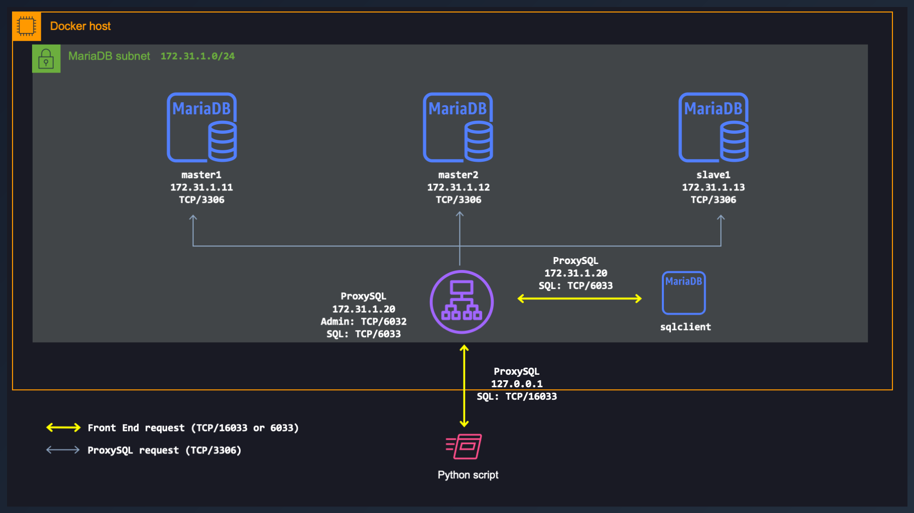

# ProxySQL on Docker

## Introduction

In this workshop, I'll demonstrate how to configure a ProxySQL server that fronts some MariaDB SQL servers. The ProxySQL will be hosted in a Docker container and the SQL TCP port  will be exposed on the Docker host. To test the load balancing capability of ProxySQL, I've built a Python script to query the SQL servers and get their host name.

  

## Requirements:

* Familiarity with basic [MySQL](https://www.mysqltutorial.org/) commands.
* Familiarity with [Docker](https://www.docker.com/).
* Docker Desktop installed locally.
* Docker container with `mysql` command line interface. I'm using MariaDB, you could also use MySQL.

## Let's build the ProxySQL

### Get ProxySQL image from Docker hub

```docker
docker pull proxysql/proxysql
```

### Start the ProxySQL server

Before you start the container, you need to prepare a configuration file. If you don't, you won't be able to remotly connect to the server via the command line interface. Below is the minimal file. Save it to a directory with the filename `proxysql.conf`.

```c
# Config file contents referred to as "/path/to/proxysql.conf"
datadir="/var/lib/proxysql"

admin_variables=
{
    admin_credentials="admin:admin;radmin:radmin"
    mysql_ifaces="0.0.0.0:6032"
}

mysql_variables=
{
    threads=4
    max_connections=2048
    default_query_delay=0
    default_query_timeout=36000000
    have_compress=true
    poll_timeout=2000
    interfaces="0.0.0.0:6033"
    default_schema="information_schema"
    stacksize=1048576
    server_version="5.5.30"
    connect_timeout_server=3000
    monitor_username="monitor"
    monitor_password="monitor"
    monitor_history=600000
    monitor_connect_interval=60000
    monitor_ping_interval=10000
    monitor_read_only_interval=1500
    monitor_read_only_timeout=500
    ping_interval_server_msec=120000
    ping_timeout_server=500
    commands_stats=true
    sessions_sort=true
    connect_retries_on_failure=10
}
```

I'm using a custom network and I assign a static IP address for the container. Change the `/path/to/proxysql.conf` for the real path on your local disk.

```docker
docker run -d --network MariaDB --rm \
--name proxysql \
--hostname proxysql \
--ip 172.31.1.20 \
-p 16032:6032 \
-p 16033:6033 \
-p 16070:6070 \
-v /path/to/proxysql.conf:/etc/proxysql.cnf \
--env TZ='America/New_York' \
proxysql/proxysql
```

### Start a MySQL client

We need to connect to the ProxySQL server started in the preceding step. I'm using the official MariaDB SQL Docker container. Since the client and ProxySQL containers are in the same network, use the real `TCP-port`. The username and password, for a new ProxySQL, is `radmin/radmin`. Don't use `admin/admin` or you will have the message `ERROR 1040 (42000): User 'admin' can only connect locally`.

Open a `terminal` and start another Docker container that has the `mysql`client command line interface.

```docker
docker run -it --network MariaDB --rm \
--name sqlclient \
--hostname sqlclient \
mariadb \
mysql -hproxysql -P6032 -uradmin -pradmin --prompt="\u@\h:[\d]>\_"
```

After you connect, the prompt will look like `radmin@proxysql:[(none)]>`. This is where we will enter all the commands to configure ProxySQL.

The configuration will be done on those three tables, `mysql_servers`, `mysql_replication_hostgroups` and `mysql_query_rules`. Verify that they are empty before starting.

```sql
SELECT * FROM mysql_servers;
SELECT * from mysql_replication_hostgroups;
SELECT * from mysql_query_rules;
```

The results for each command should be :
```sql
Empty set (0.00 sec)
```

### Add backends

For this workshop, I will assume that you have three MariaDB SQL servers configured for replication. See my other workshop [here](https://github.com/ddella/MariaDB-Replication) to setup MariaDB servers with replication. The servers need to be added to the `mysql_servers` table. The IP addresses of the MariaDB servers are `172.31.1.1[1-3]`.

```sql
INSERT INTO mysql_servers(hostgroup_id,hostname,port) VALUES (1,'172.31.1.11',3306);
INSERT INTO mysql_servers(hostgroup_id,hostname,port) VALUES (1,'172.31.1.12',3306);
INSERT INTO mysql_servers(hostgroup_id,hostname,port) VALUES (1,'172.31.1.13',3306);
```

### Configure monitoring

A username/password needs to be created on the **MariaDB servers** for monitoring purposes.  We'll use `monitor/monitor`. The username needs only `USAGE` privileges to connect, ping and check read_only. It will also need `REPLICATION CLIENT` privilege, if it needs to monitor replication log. See this [link](https://proxysql.com/documentation/backend-monitoring/) for privileges needed.

#### Execute the following commands on either 'master1' or 'master2'

> Make sure you create this username/password on the **MariaDB servers** and not on the ProxySQL! You just need to create it on one of the master servers. It will get replicated to the other.

```sql
GRANT USAGE, REPLICATION CLIENT ON *.* TO 'monitor'@'172.31.1.0/255.255.255.0' IDENTIFIED BY 'monitor';
FLUSH PRIVILEGES;
```

#### Add the credentials of the `monitor` user to ProxySQL

> This is executed on the ProxySQL server.

```sql
UPDATE global_variables SET variable_value='monitor' WHERE variable_name='mysql-monitor_username';
```
#### Configure the various monitoring intervals

Changes made to the MySQL Monitor in table `global_variables` will be applied after executing the `LOAD MYSQL VARIABLES TO RUNTIME` statement. To persist the configuration changes across restarts, the `SAVE MYSQL VARIABLES TO DISK` command must also be executed.

```sql
UPDATE global_variables SET variable_value='2000'  WHERE variable_name IN ('mysql-monitor_connect_interval','mysql-monitor_ping_interval','mysql-monitor_read_only_interval');
LOAD MYSQL VARIABLES TO RUNTIME;
SAVE MYSQL VARIABLES TO DISK;
```

### Backend’s health check

Verify that the servers are being monitored correctly with the commands below:

```sql
SELECT * FROM monitor.mysql_server_connect_log ORDER BY time_start_us DESC LIMIT 3;
SELECT * FROM monitor.mysql_server_ping_log ORDER BY time_start_us DESC LIMIT 3;
```

This is the exxpected results.


	+-------------+------+------------------+-------------------------+---------------+
	| hostname    | port | time_start_us    | connect_success_time_us | connect_error |
	+-------------+------+------------------+-------------------------+---------------+
	| 172.31.1.12 | 3306 | 1645049907983865 | 3249                    | NULL          |
	| 172.31.1.13 | 3306 | 1645049907954929 | 3394                    | NULL          |
	| 172.31.1.11 | 3306 | 1645049907926771 | 3426                    | NULL          |
	+-------------+------+------------------+-------------------------+---------------+
	3 rows in set (0.001 sec)

	+-------------+------+------------------+----------------------+------------+
	| hostname    | port | time_start_us    | ping_success_time_us | ping_error |
	+-------------+------+------------------+----------------------+------------+
	| 172.31.1.12 | 3306 | 1645049949736980 | 1945                 | NULL       |
	| 172.31.1.13 | 3306 | 1645049949709126 | 848                  | NULL       |
	| 172.31.1.11 | 3306 | 1645049949683246 | 428                  | NULL       |
	+-------------+------+------------------+----------------------+------------+
	3 rows in set (0.002 sec)

#### Activate the configuration

When everything is healthy, activate the configuration with:

```sql
LOAD MYSQL SERVERS TO RUNTIME;
```

Check the table `mysql_servers`.

```sql
SELECT * FROM mysql_servers;
```
	+--------------+-------------+------+-----------+--------+--------+-------------+-----------------+---------------------+---------+----------------+---------+
	| hostgroup_id | hostname    | port | gtid_port | status | weight | compression | max_connections | max_replication_lag | use_ssl | max_latency_ms | comment |
	+--------------+-------------+------+-----------+--------+--------+-------------+-----------------+---------------------+---------+----------------+---------+
	| 1            | 172.31.1.11 | 3306 | 0         | ONLINE | 1      | 0           | 1000            | 0                   | 0       | 0              |         |
	| 1            | 172.31.1.12 | 3306 | 0         | ONLINE | 1      | 0           | 1000            | 0                   | 0       | 0              |         |
	| 1            | 172.31.1.13 | 3306 | 0         | ONLINE | 1      | 0           | 1000            | 0                   | 0       | 0              |         |
	+--------------+-------------+------+-----------+--------+--------+-------------+-----------------+---------------------+---------+----------------+---------+
	3 rows in set (0.001 sec)

### MySQL replication hostgroups

The following command will place all the MySQL backend servers that are either configured in host group 1 or 2 into their respective host group based on their `read_only` value:

```sql
INSERT INTO mysql_replication_hostgroups (writer_hostgroup,reader_hostgroup,comment) VALUES (1,2,'cluster1');
```

To enable the replication host group, load it to run time.

```sql
LOAD MYSQL SERVERS TO RUNTIME;
```

The `read_only` check results are logged to the `mysql_servers_read_only_log` table in the `monitor` database. In this case, server `172.31.1.13` is `slave1` and is `read_only`. Verify that ProxySQL is monitoring the `read_only` value for the servers with the command:

```sql
SELECT * FROM monitor.mysql_server_read_only_log ORDER BY time_start_us DESC LIMIT 3;
```

	+-------------+------+------------------+-----------------+-----------+-------+
	| hostname    | port | time_start_us    | success_time_us | read_only | error |
	+-------------+------+------------------+-----------------+-----------+-------+
	| 172.31.1.13 | 3306 | 1645043486338462 | 785             | 1         | NULL  |
	| 172.31.1.12 | 3306 | 1645043486316734 | 667             | 0         | NULL  |
	| 172.31.1.11 | 3306 | 1645043486295188 | 509             | 0         | NULL  |
	+-------------+------+------------------+-----------------+-----------+-------+
	3 rows in set (0.001 sec)

As a final step, persist the configuration to disk.

```sql
SAVE MYSQL SERVERS TO DISK;
SAVE MYSQL VARIABLES TO DISK;
```

## MySQL Users

After configuring the MySQL server backends in `mysql_servers`, the next step is to configure `mysql` users on ProxySQL **and** the backend servers. In ProxySQL, this is performed by adding entries to the `mysql_users` table. On MariaDB, this is performed by adding entries to the `user` in the database `sys`
table.

### ProxySQL

The table on the ProxySQL server is initially empty, to add users, specify the `username`, `password` and `default_hostgroup`. This is the `username/password` received by the clients. The clients might be a PHP front end that queries the database.

```sql
INSERT INTO mysql_users(username,password,default_hostgroup) VALUES ('clients','clients',1);
```

Do not forget to load the new user in run time. The `save` is optional.

```sql
LOAD MYSQL USERS TO RUNTIME;
SAVE MYSQL USERS TO DISK;
```

Check that the user has been created:

```sql
SELECT * FROM mysql_users;
```
	+----------+----------+--------+---------+-------------------+----------------+---------------+------------------------+--------------+---------+----------+-----------------+------------+---------+
	| username | password | active | use_ssl | default_hostgroup | default_schema | schema_locked | transaction_persistent | fast_forward | backend | frontend | max_connections | attributes | comment |
	+----------+----------+--------+---------+-------------------+----------------+---------------+------------------------+--------------+---------+----------+-----------------+------------+---------+
	| clients  | clients  | 1      | 0       | 1                 | NULL           | 0             | 1                      | 0            | 1       | 1        | 10000           |            |         |
	+----------+----------+--------+---------+-------------------+----------------+---------------+------------------------+--------------+---------+----------+-----------------+------------+---------+
	1 row in set (0.002 sec)


### Backend servers

Execute this command on any of the MariaDB master server. In this workshop I have a database `webapp` that I need to give access to the front end. Adjust the database for your needs.

```sql
GRANT ALL PRIVILEGES ON webapp.* TO 'clients'@'172.31.1.0/255.255.255.0' IDENTIFIED BY 'clients';
FLUSH PRIVILEGES;
```
Check that the user has been created.

```sql
select user,host from mysql.user;
```

	+--------------+--------------------------+
	| User         | Host                     |
	+--------------+--------------------------+
	| root         | %                        |
	| clients      | 172.31.1.0/255.255.255.0 |
	| mariadb.sys  | localhost                |
	| root         | localhost                |
	+--------------+--------------------------+
	4 rows in set (0.005 sec)


## Testing

ProxySQL is now ready to serve traffic on port `6033`. Let's use two methods to test our proxy.

1. A python script on the Docker host that will send requests to `TCP/16033`. This port is mapped to `TCP/6033` in the ProxySQL container.
2. A new container with the `mysql`client command line interface. 

### Python

ProxySQL is now ready to serve traffic on port `6033` or on port `16033` from the Docker host. The following script is not meant to be optimal but rather to initiate as many connections as possible to have ProxySQL load balance the requests.

```python
import mysql.connector  
import logging  
import time  
  
MAX_QUERY = 25  
  
def getHostname(db):  
    try:  
        cursor = db.cursor(dictionary=True)  
        cursor.execute("SELECT @@hostname hostname")  
  
        # get all records  
  records = cursor.fetchall()  
        host = records[0]['hostname']  
  
        cursor.close()  
    except mysql.connector.ProgrammingError as error:  
        logger.error(f'err.errno={error.errno} - err.sqlstate={error.sqlstate} - err.msg={error.msg}')  
        host = None  
 except mysql.connector.Error as error:  
        logger.error(error)  
        host = None  
 return host  
  
  
if __name__ == '__main__':  
    # logger config  
  logger = logging.getLogger()  
    logging.basicConfig(level=logging.INFO,  
  format='%(asctime)s: %(levelname)s: %(message)s')  
  
    for _ in range(MAX_QUERY):  
        try:  
            # creating connection to database  
  mydb = mysql.connector.connect(  
                host="localhost",  
  user="clients",  
  password="clients",  
  port="16033",  
  )  
        except mysql.connector.ProgrammingError as err:  
            logger.error(f'err.errno={err.errno} - err.sqlstate={err.sqlstate} - err.msg={err.msg}')  
        except mysql.connector.Error as err:  
            logger.error(err)  
        else:  
            # get the hostname and SQL version of server  
  db_Info = mydb.get_server_info()  
            logger.info(f"Connected to MySQL Server: {getHostname(mydb)} - version: {db_Info}")  
  
            if mydb.is_connected():  
                mydb.close()  
  
            # wait  
  time.sleep(1)
```

### MySQL command line interface 

Exit the SQL client started at the beginning of this workshop and execute SQL statement towards the ProxySQL server. If you execute the query multiple times, you will see responses from `master1` and `master2` in round robin.

```sh
docker run -it --network MariaDB --rm \
--name sqlclient \
--hostname sqlclient \
mariadb \
mysql -u clients -pclients -h proxysql -P6033 -e"SELECT @@hostname hostname"
```

	+----------+
	| hostname |
	+----------+
	| master2  |
	+----------+

	+----------+
	| hostname |
	+----------+
	| master1  |
	+----------+


## Useful Links

Nice and useful links.

- [ProxySQL](https://proxysql.com/documentation/ProxySQL-Configuration/)
- [Nice MySQL training](https://www.mysqltutorial.org/)

## License

This project is licensed under the [MIT license](LICENSE).

[*^ back to top*](#ProxySQL-on-Docker)


